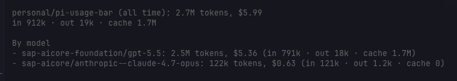

# pi-usage-bar

A local Pi extension that combines a compact footer/statusline with a persistent token/cost usage ledger.



## Goals

- Show a Claude-Code-style footer with model, context pressure, current session usage, cost, current project, and extension statuses.
- Persist assistant-response usage events to a local SQLite database.
- Attribute usage to projects using git remotes, git roots, local `Developer/gitroot` paths, and configurable aliases.
- Provide `/usage` reporting and management commands for session/day/project/model/session rollups.
- Expose an agent-callable `usage_query` tool for local usage analytics.

## Install

### From npm

```bash
pi install npm:pi-usage-bar
```

Reload Pi if it is already running:

```text
/reload
```

### Local development

From this repo:

```bash
npm install
npm run check
npm test
```

Then add the package path to Pi settings, preferably after `npm:pi-bar` if both are installed and this footer should win:

```json
{
  "packages": [
    "npm:pi-bar",
    "../../Developer/gitroot/personal/pi-usage-bar"
  ]
}
```

Reload Pi with:

```text
/reload
```

### Alternative: install from git

```bash
pi install git:github.com/ttiimmaahh/pi-usage-bar@main
```

## Footer

The footer renders one or two lines depending on config:

```text
<model> │ <context bar + percent/window> │ sess <tokens> │ <cost> │ <project-or-repo:branch> │ <extension statuses>        thinking: <level>
▶ in <tokens> · out <tokens> · cache <tokens> · project today <tokens> · <branch>
```

When Pi runs outside any git repository, the project segment falls back to the current folder name. When Pi runs inside a git repository, the project segment shows `<repo>:<branch>` (for example, `example/app:main`). Ambiguous gitroot parent directories, such as `/Developer/gitroot/personal`, are displayed as `<scope>/_root` and highlighted in warning color. Pi also shows a one-time notification explaining whether to use a one-time `move` or persistent `alias`.

Customize footer segments:

```text
/usage segments list
/usage segments only model context session cost project thinking
/usage segments hide extensions
/usage segments show extensions
/usage segments hide thinking
/usage segments second-line off
/usage segments second-line on
```

Available segments:

```text
model context session cost project extensions thinking
```

The `thinking` segment shows the current Shift+Tab thinking/effort level and is right-aligned when visible.

## Usage ledger

Default database path:

```text
~/.pi/agent/usage/usage.sqlite
```

Override with:

```bash
PI_USAGE_BAR_DB=/path/to/usage.sqlite pi
```

The config path defaults to:

```text
~/.pi/agent/pi-usage-bar/config.json
```

Override with:

```bash
PI_USAGE_BAR_CONFIG=/path/to/config.json pi
```

Each assistant message with usage metadata is appended to `usage_events` with:

- session id/file/name, subject to privacy config
- cwd, subject to privacy config
- git root/branch/remote, subject to privacy config
- derived project key
- provider/model
- input/output/cache tokens
- cost fields exposed by Pi/provider

Events use SHA-256 deterministic ids and a natural unique index on `(session_id, timestamp, provider, model, total_tokens)` so session-start backfill and reloads are safe.

## Commands

```text
/usage session                         # current session totals
/usage today                           # today rollup by project
/usage yesterday                       # yesterday rollup by project
/usage week                            # last 7 days rollup by project
/usage month                           # last 30 days rollup by project
/usage since <YYYY-MM-DD>              # project rollup since a day
/usage between <YYYY-MM-DD> <YYYY-MM-DD> # project rollup for a date range
/usage project [project] [range]       # current or explicit project totals plus model breakdown
/usage projects [range]                # top projects
/usage models [range]                  # top models with token/cost totals
/usage sessions [range]                # top sessions
/usage summary [range]                 # combined total plus model cost breakdown
/usage summary <project> [range]       # project total plus model cost breakdown
/usage export [limit]                  # export recent usage rows to JSON
/usage memory-summary [range]          # compact summary suitable for saving as memory
/usage doctor                          # DB/config/footer diagnostic
/usage attribute                       # interactive attribution picker
/usage aliases                         # list configured project aliases
/usage unalias <from>                  # remove a project alias
/usage undo [operation-id]             # undo last/specific attribution operation
/usage move <from> to <to>             # one-time merge without future alias
/usage merge <from> into <to>          # synonym for move; one-time merge
/usage change <from> to <to>           # merge and persist future alias
/usage alias <from> to <to>            # synonym for change; merge and alias
/usage segments list                   # show visible footer segments
/usage segments only <segments...>     # replace visible footer segments
/usage segments show <segments...>     # add visible footer segments
/usage segments hide <segments...>     # hide footer segments
/usage segments second-line on|off     # toggle the detail line
/usage display project short|full      # shorten or expand project labels in footer
/usage backup                          # copy the SQLite ledger to backups/
/usage db                              # show SQLite path
/usage config                          # show config path, aliases, and privacy settings
/usage help                            # command summary
```

Range forms accepted by rollup commands:

```text
all
today
yesterday
week
month
since 2026-06-01
between 2026-06-01 2026-06-12
2026-06-12
```

Examples:

```text
/usage projects week
/usage models month
/usage summary week
/usage sessions since 2026-06-01
/usage project personal/pi-usage-bar week
/usage summary personal/pi-usage-bar week
/usage memory-summary week
```

## Reattribute usage

If a run was attributed to a broad cwd like `personal/_root`, do a one-time merge without creating a future alias:

```text
/usage move personal/_root to personal/pi-usage-bar
/usage merge personal/_root into personal/pi-usage-bar
```

Use a persistent alias only when future usage in the source should always map to the target:

```text
/usage change personal/_root to personal/pi-usage-bar
/usage alias personal/_root to personal/pi-usage-bar
```

`move` / `merge`:

1. Updates existing matching rows in SQLite by changing their `project_key`.
2. Does **not** update config aliases.
3. Warns that future usage in the source directory will remain there until manually moved again.

`change` / `alias`:

1. Updates `projectAliases` in `~/.pi/agent/pi-usage-bar/config.json`.
2. Updates existing matching rows in SQLite by changing their `project_key`.

Neither mode deletes or replaces target rows. If the target already has usage, the moved rows are combined naturally in rollups because reports group by `project_key`. The command confirmation shows moved totals, target-before totals, target-after totals, and attribution operation id.

Undo attribution:

```text
/usage undo
/usage undo 12
```

Attribution operations are stored in `usage_attribution_history`. The exact event ids moved by new attribution operations are stored in `usage_attribution_rows`, so `/usage undo` is surgical: usage added to the target after the original move stays in the target.

## Project attribution

Project key resolution order:

1. Git remote origin, normalized from GitHub URLs: `owner/repo`.
2. Local path under `/Developer/gitroot/`: e.g. `personal/pi-usage-bar`.
3. Gitroot parent dirs become `<scope>/_root`, e.g. `personal/_root`.
4. Basename of git root or cwd.
5. Config alias resolution.

## Config

Example config:

```json
{
  "segments": ["model", "context", "session", "cost", "project", "extensions", "thinking"],
  "warningThreshold": 70,
  "errorThreshold": 90,
  "showSecondLine": true,
  "projectAliases": {
    "personal/_root": "personal/pi-usage-bar"
  },
  "display": {
    "projectLabel": "full",
    "hideThinking": false
  },
  "privacy": {
    "storeCwd": true,
    "storeGitRemote": true,
    "storeSessionFile": true,
    "storeSessionName": true,
    "hashSessionIds": false
  }
}
```

Privacy fields affect newly logged events only; they do not rewrite historical rows.

Display settings control footer presentation only. `display.projectLabel: "short"` shows the last path segment in the footer while keeping full project keys in the ledger and reports. The `thinking` segment shows the current thinking/effort level and is right-aligned by default, including for existing configs. Use `/usage segments hide thinking` to persist `display.hideThinking: true`.

## Pricing note

Model breakdowns show the dollar amount for the tokens used by each model. When a model-list-pricing snapshot is available, the displayed amount is recalculated from that snapshot and the recorded input/output/cache token counts. When no pricing snapshot is available for a historical row, the report falls back to the cost Pi/provider recorded at usage time. These are list-price style estimates and do **not** account for provider discounts, enterprise subsidies, credits, negotiated rates, or SAP/tenant-specific billing adjustments.

## Agent tool

The extension registers an agent-callable tool:

```text
usage_query
```

Parameters:

```json
{
  "groupBy": "summary | project | model | session",
  "range": "today | week | month | since YYYY-MM-DD | between YYYY-MM-DD YYYY-MM-DD | all",
  "projectKey": "optional project filter; for summary, returns that project's model breakdown",
  "limit": 10
}
```

Example natural-language request:

```text
Use usage_query to summarize token usage by project for this week.
```

## Database schema

Main tables:

- `usage_events` — one row per assistant message usage event. Includes provider/model, token classes, computed costs, and a model-list-pricing snapshot (`price_input`, `price_output`, `price_cache_read`, `price_cache_write`, `price_source`) for newly logged rows. Reports show these as list prices per 1M tokens when available.
- `usage_meta` — schema version metadata.
- `usage_attribution_history` — attribution operations for `/usage undo`.
- `usage_attribution_rows` — event ids moved by each attribution operation, used for surgical undo.

Current schema version: `5`.

## Releasing

This repo follows the same release process as `pi-sap-aicore`:

1. Ensure `npm run check` passes locally.
2. Update `CHANGELOG.md` for the release.
3. Run `npm version patch` (or `minor` / `major`) to update `package.json`, create a commit, and tag `vX.Y.Z`.
4. Push with `git push --follow-tags`.
5. The tag-triggered GitHub Actions workflow verifies the tag, runs `npm run check`, publishes to npm using Trusted Publishing/OIDC, and creates a GitHub Release.

One-time npm setup: configure `ttiimmaahh/pi-usage-bar` and `.github/workflows/publish.yml` as a Trusted Publisher for the `pi-usage-bar` package on npmjs.com.

## Production checks

```bash
npm run check
npm test
pi -p --no-session --no-tools 'quick smoke test'
sqlite3 ~/.pi/agent/usage/usage.sqlite 'select count(*), sum(total_tokens), sum(cost_total) from usage_events;'
sqlite3 ~/.pi/agent/usage/usage.sqlite 'select key,value from usage_meta;'
```

Note: print-mode Pi prompts do not exercise TUI notifications, but they do load the extension and migrate/create the DB.

## Notes

This is intentionally not a fork of `pi-bar`: `pi-bar` is a great UI reference, but `pi-usage-bar` treats the local usage ledger as the source of truth and the footer as a view over that ledger.
